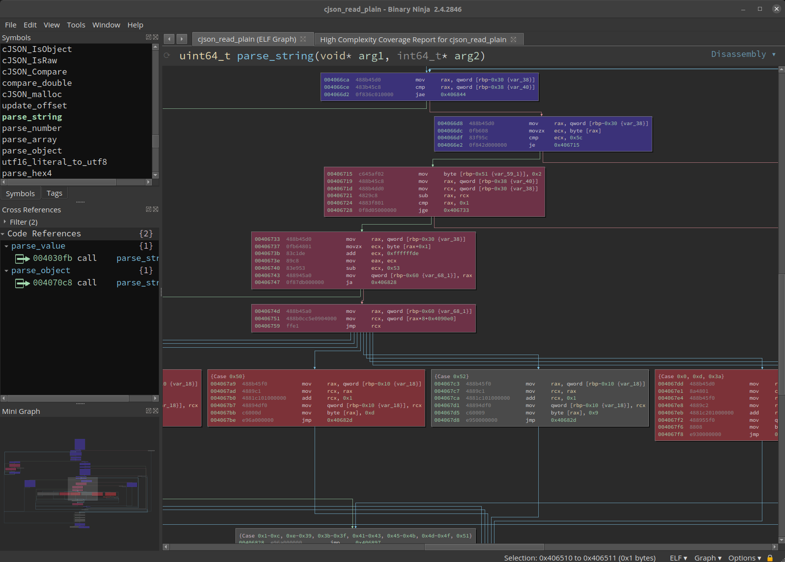
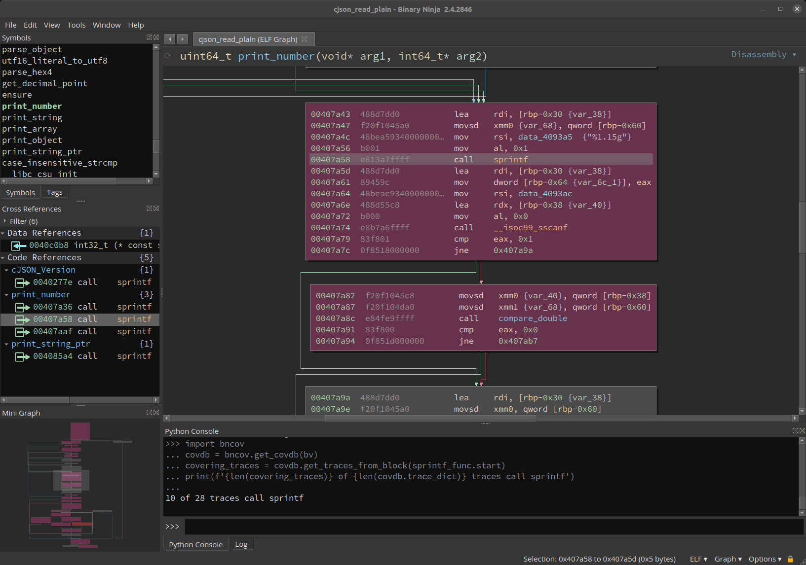
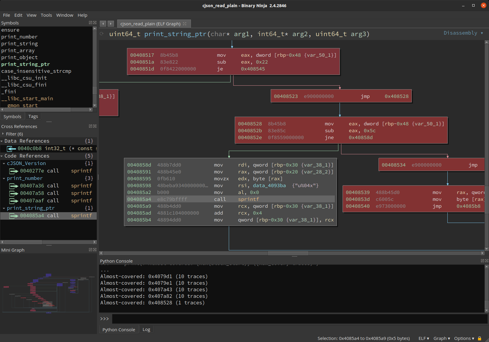
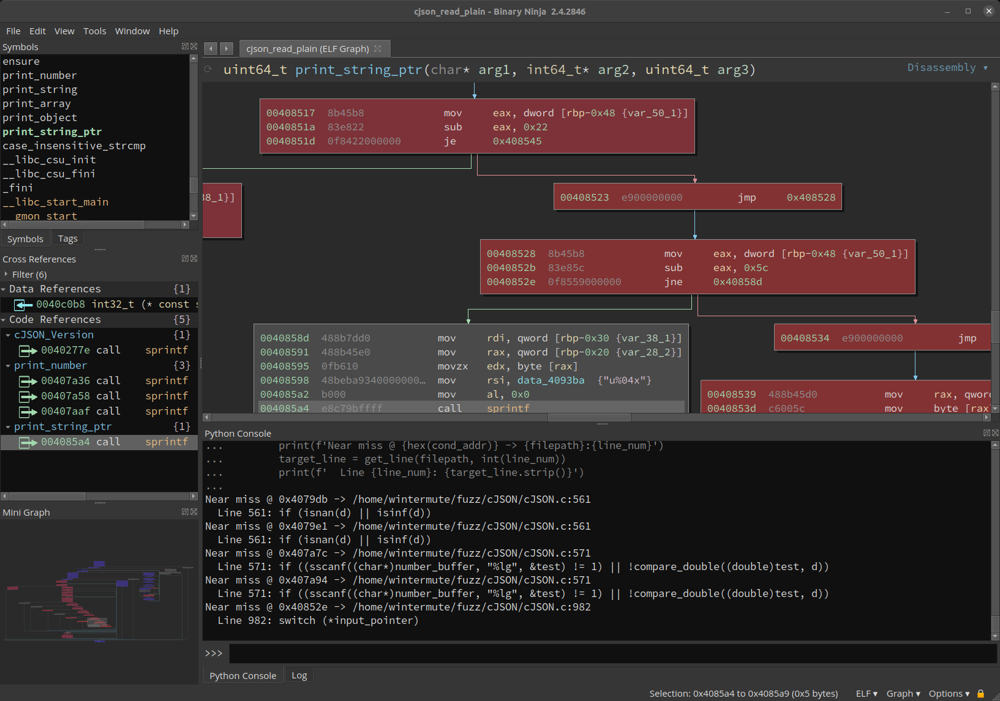

I've been updating the
[bncov plugin](https://github.com/ForAllSecure/bncov)
for Binary Ninja, and it strikes me that automated coverage analysis is a
bit of an underexplored concept, so I thought I'd write a bit about it and talk
about why I think automating coverage analysis can be useful. It seems like
when most people talk about code coverage, they're normally talking about test
coverage, but coverage analysis has also been discussed by security researchers
like
[Ned Williamson](https://www.youtube.com/watch?v=xzG0pLM4Q64) in the context of
finding bugs and improving fuzzing efforts.

The latter example is more interesting to me, but people used to software
development will tell you how useful the former is for finding bugs ;) In
this post I'll talk about why I think coverage analysis is more than just pretty
colors in your reversing tool; that it is a great way to automate answering
analysis questions and can be a good building block for other tools. Even if you
don't ever want to leave your manual workflow, by the end I hope we can all at
least agree that we don't want to manually turn a crank to get coverage
information.

|  |
| :-: |
| *what could be more important than pretty colors?* |

## Coverage Analysis

We'll skip the basics of different types of
[code coverage](https://en.wikipedia.org/wiki/Code_coverage),
I'm just going to say that basic block coverage is roughly equivalent to line
coverage, and these are the simplest and most lightweight types of coverage
information. The major difference between the two is that line coverage requires
source to have meaning, so I'll talk block coverage because I prefer my tools to
work in the cases where we might not have such niceties. Making use of basic
block coverage does require knowledge of where basic blocks are, which you
cant get either from your compiler or a reverse-engineering tool.  I use
[Binary Ninja](https://binary.ninja/)
primarily because I find their API pleasant to work with, but this kind of
analysis could also be done with IDA, Ghidra, etc.

You can collect block coverage through a number of tools, either via
compiled-in instrumentation such as
[SanCov](https://clang.llvm.org/docs/SanitizerCoverage.html#default-implementation),
or if you don't have source, through DBI tools such as Pin and 
[DynamoRIO](https://dynamorio.org/page_drcov.html). In a pinch you
can even
[use a debugger](https://github.com/mechanicalnull/binja-debugger-scripts/blob/master/debugger_block_coverage.py)
or depending on your debugger you might be able to extract
[coverage from "timeless debugging" trace files](https://github.com/0vercl0k/windbg-scripts/tree/master/codecov).
There's a few different common formats, but it should be easy enough to convert
from to another, and as you can see there's almost always a way you can get it.

The idea is to exercise your target under different situations of interest and
gather coverage in these different situations. In fuzzing, this is simply just
sending different inputs to the target. In more manual situations, you could
gather coverage on a server just as it starts up and sits idle, and then repeat
the process but this you actually connect to it. You can also just run a target
once and use the coverage information as a guide, but for the purposes of what
I'm going to talk about, it makes the most sense in the context of multiple
coverage files.

You can import the coverage files into your reversing tool
of choice with something like
[Lighthouse](https://github.com/gaasedelen/lighthouse)
or
[DragonDance](https://github.com/0ffffffffh/dragondance),
and these tools work well for manual workflows, but I think there's a lot of
interesting applications that really demands being able to use the data in
arbitrary analysis scripts, and bncov is the only thing I know that makes this
easy.

## Coverage Analysis in Scripting

It doesn't take much data to make a working abstraction for block coverage,
all bncov really does is give you two simple mappings (basic blocks to trace
files and then the inverse mapping) and a bunch of helpers, but it turns out you
don't need a whole lot more. The block coverage information is just a bridge
between data about a particular execution (dynamic) and the code that was
covered (static). You can bring in more information on either the static or
dynamic side and do very interesting things.

Probably the most obvious thing to include is static analysis information since
we're already using Binary Ninja and it already has a ton of interesting
information about your target. Common workflows like "did the target execute any
_dangerous functions_?" now become simple, you just have to know how to define
what you're looking for.  The snippet below shows identifying which traces
contained calls to `sprintf`, a function that can commonly result in buffer
overflows because it doesn't check the length of the destination buffer:

```python
# Start with an active BinaryView variable bv
sprintf_func = bv.get_functions_by_name('sprintf')[0]

# Import your coverage traces, then do
import bncov
covdb = bncov.get_covdb(bv)
covering_traces = covdb.get_traces_from_block(sprintf_func.start)
print(f'{len(covering_traces)} of {len(covdb.trace_dict)} traces call sprintf')
```

|  |
| :-: |
| *Finding covered cross-refs via scripting* |

If you're not familiar with bncov, it uses a highlighting color scheme where
uncovered blocks remain their normal color (grey in the screenshots), and
covered blocks range between blue, purple, and red. What determines the color in
that spectrum is how many traces cover that block relative to the total number
of traces. So if 100% of the traces cover a block, it's blue; if only one trace
covers a block, it's red; and if about half of the traces cover a block, it's
purplish. This color scheme is helpful for determining what functionality is
common and core to all execution and what parts of code are only used some of
the time. If you want to highlight a particular trace, you can do
`bncov.highlight_trace(bv, t, 'green')` and flip things back with
`bncov.restore_default_highlights(bv)`.

So now we have a list of covered calls to `sprintf`, which is clearly just the
tip of the iceberg, because it shows you something you could have put together
with something as simple as a debugger. With Binary Ninja's knowledge of
control-flow graphs, you can also find places where your target _could_ have
called `sprintf` but was one basic block away and decided not to do that (which
may be interesting because your fuzzer wasn't able to discover the vulnerable
functionality or something along those lines):

```python
almost_calls = []
sprintf_calls = bv.get_callers(sprintf_func.start)

for xref in sprintf_calls:
    for block in bv.get_basic_blocks_at(xref.address):
        # Look for: block is uncovered but its predecessor is covered
        if block.start not in covdb.block_dict:
            for in_edge in block.incoming_edges:
                in_block = in_edge.source
                if in_block.start in covdb.block_dict:
                    almost_calls.append(in_block.start)

for block_start in almost_calls:
    num_cover = len(covdb.block_dict[block_start])
    print(f'Almost-covered: {hex(block_start)} ({num_cover} traces)')
```

|  |
| :-: |
| *But why didn't we get to this call?* |

You could go a step further and bring in more external information, let's
take the example of having source code available. Since we have source, we
can make a debug build of the target that will contain line tables, and then
you can use that debug information to pull the line of source code where the
branch away from `sprintf` is. If you've never thought about how debuggers like
gdb can show you source in certain situations, line tables are the magic DWARF
information behind the `-g` switch.

```python
import subprocess

def get_line(file, line_num):
    line_num -= 1  # addr2line counts lines starting at 1
    with open(file, 'r') as f:
        line = f.readlines()[line_num]
    return line

# Path to our debug binary that exactly matches our source code on disk
target = bv.file.original_filename

def get_file_and_line(address):
    addr2line_cmd = f'addr2line -e {target} -a {hex(address)}'
    addr2line_output = subprocess.getoutput(addr2line_cmd)
    # addr2line should output two lines, we want the second
    file_and_line = addr2line_output.split('\n')[1]
    # output looks like: 'path/to/file.c:101'
    filepath, line_num = file_and_line.split(':')
    return filepath, int(line_num)

for block_start in almost_calls:
    for basic_block in bv.get_basic_blocks_starting_at(block_start):
        # Get last instruction in the block (likely conditional jump)
        disasm_lines = basic_block.get_disassembly_text()
        last_inst = disasm_lines[-1]
        cond_addr = last_inst.address
        # Look up the source line for that instruction, and print it
        filepath, line_num = get_file_and_line(cond_addr)
        print(f'Near miss @ {hex(cond_addr)} -> {filepath}:{line_num}')
        target_line = get_line(filepath, int(line_num))
        print(f'  Line {line_num}: {target_line.strip()}')
```

|  |
| :-: |
| *Automagic source correlation for covered locations of interest* |

This prints out source code that contains things like if-statements or switch
statements that we didn't fully test, either because we didn't have the 
appropriate testcase or because the conditions are impossible to fulfill and the
call target beyond is actually dead code. So we've gone from having a question
about what happened over the course of multiple (even hundreds or thousands) of
execution, and finished with potential leads in the source code that we can
manually audit.

The possibilities of this kind of analysis are really interesting to me, and
it's all because block coverage information (as limited as it is) gives us a
link between the static analysis and the actual execution of the target under a
particular scenario. If you like the idea of being able to resolve addresses in
a debug binary to the source code you compiled it from, check out
`find_uncovered_calls.py` in the bncov repo or
my [sourcery pane](https://github.com/mechanicalnull/sourcery_pane) plugin
that can show you source code as you navigate in Binary Ninja's UI.

## Automating Coverage Analysis

So manually spitballing analysis in the Python console is great, but maybe
you're like me; and I wouldn't say we're lazy or anything but it gets old typing
things out all the time... so let's try to automate things and make the
computers do work so we don't have to!

The most obvious thing to do is to set up a coverage pipeline for your testing,
which makes the most sense for automated input generation like fuzzing.
You could do coverage processing as one batch once you have all your inputs, or
you can leave a continuous processing pipeline up if you wanted to see things
happening in near-realtime (to do this with bncov, use `--continuously_monitor`
with `dr_block_coverage.py` and then "Import Directory and Watch" in the Binary
Ninja UI). Either way, with a robust enough coverage-gathering script this is
basically one extra step to add to your pipeline, and then you have your
coverage which you use by taking those clever scripts you were typing into the
Python console and put them in a tidy little script/snippet/plugin.

Now we're at the point where we can also be continuously analyzing coverage and
running whatever analysis we want. This is where things really get interesting,
and I plan to write and release more ideas and tools in this area. In the short
term, you should check out some of the scripts that come with bncov if you want
to explore this more in terms of what kinds of analysis might be useful, though
coverage analysis is very flexible and your questions and corresponding analysis
will probably be different depending on what you're doing.

## The Next Step: Building Bigger

My favorite part about this stuff is actually building the tools on top of it,
because I like making things and being able to see all the information I want to
see. I think basic block data is great for this because it makes a good bridge
between the static and dynamic worlds. It also doesn't take up much space, which
matters if you've got thousands of executions from different fuzz inputs,
because then you can use the analysis on block coverage as a filter to determine
when you want to do something more storage-intensive like a full-system trace.

Today we showed some basic use cases that serve as the basic motivation for
using coverage analysis, setting the stage for future posts where we can cut
right to shiny tools and analyses. I've been working on building a few things,
some big and some small, that I hope to release soon, so stay tuned here (or
on [Twitter](https://twitter.com/mechanicalnull)) to keep up as things roll
out.

