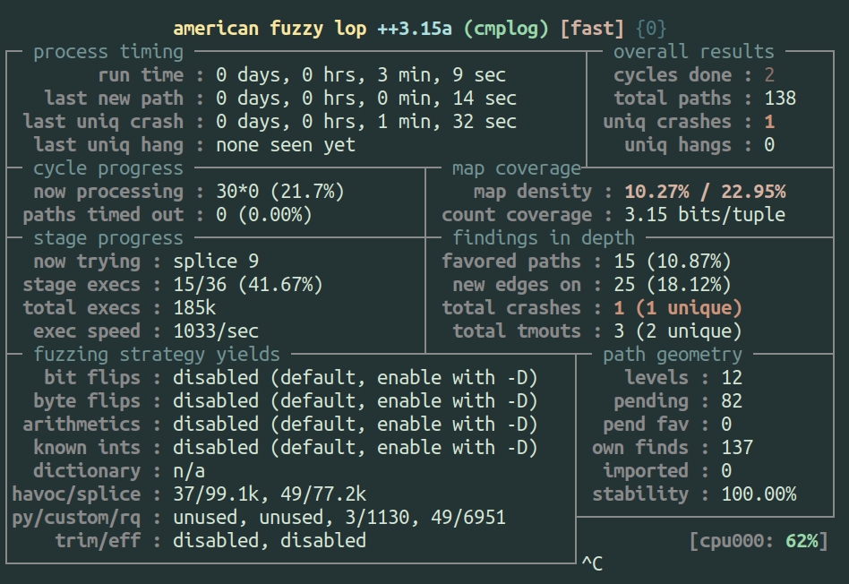

One of the things I find most interesting about software bugs is the stories
behind them. Think about it: as unconscious creations, bugs don't have a
story until they are discovered, and only then do they take on meaning. 

The initial discovery is a private experience, when someone notices the
potential flaw and begins to understand its possibilities. The story of the bug
then becomes a reflection of both the developer and the discoverer. For a few
bugs, their story takes on many more reflections as it affects many more people,
either as an inspiration or a warning. Due to the churn in production and
maintenance cycles, the stories of most imperfections in software are short and
uninteresting. But a select few achieve fame, and I think it's interesting to
look at them for both their story and the code behind it.

This post is comprised of two parts: some of the story of behind a famous bug
and my experiment in applying modern fuzzing approaches to return to the bug's
grand rematch. If you just came for the fuzzing, you can
[skip ahead](#rematch-redux-with-afl)

Any errors in the history of this bug are the fault of the author as I am not a
primary source, and I will gladly accept clarifications and factual corrections.
But this is how things are, each retelling of a story is its own reflection that
emphasizes or changes things; at some point we should only care to learn from
the true technical details, and leave ourselves to be entertained by legend.

## The "crackaddr" bug

The crackaddr bug 
([CVE-2002-1337](https://cve.mitre.org/cgi-bin/cvename.cgi?name=CVE-2002-1337),
and no I'm not making that up) was initially found by Mark Dowd in 2002 via
manual auditing of the `sendmail` codebase and it was publicly disclosed in
early 2003.  The bug itself is a buffer overflow that occurs when a crafted
email address is processed by the `crackaddr` function. This represents a pretty
serious attack vector for remote exploitation, especially at the time. What made
the bug interesting though, was that in order to cause the buffer overflow, it
requires a series of specific transitions in the implicit state machine of a
parsing loop. These specific state transitions cause a desynchronization between
the expected end and actual end of the buffer, which eventually leads to a
buffer overflow.

The hacker group Last Stage of Delirium (aka LSD) posted a
[writeup](https://lwn.net/Articles/24292/) 
to the Bugtraq mailing list in 2003 explaining the bug and how to exploit it.
Their conclusion was that the impact was limited due to the location of the
static buffer being overflowed and what was around it, which is influenced by
compiler decisions. Their investigation concluded that the bug didn't seem
exploitable by default on most distributions, and their assessment of the bug
was that it was rather limited and not as significant as it appeared on first
glance.  So why did the bug become famous?

## The Challenge

While I wasn't able to find much mention of what kept the bug alive in the
hacker mindscape in the intervening years, the bug surfaced in a
[keynote presentation](https://downloads.immunityinc.com/infiltrate-archives/Fundamentals_of_exploitation_revisited.pdf)
by Halvar Flake (Thomas Dullien) at the INFILTRATE 2011 conference.

In this presentation, he presents the bug as a challenge to the program analysis
community. His position was that navigating implicit state machines were
difficult for the current state of tooling to successfully reason about,
especially with the presence of certain factors that are common in real-world
code but unfavorable to automatic analysis. This was around the time when 
[academic papers](http://bitblaze.cs.berkeley.edu/papers/apeg.pdf) and
discussions about the possibilities of automated exploit generation were
becoming popular, so naturally this became a popular point of discussion.

While the figurative throwing of the gauntlet by Halvar Flake spawned 
[several](https://downloads.immunityinc.com/infiltrate-archives/infiltrate-jvanegue.pdf) 
[talks](http://2015.hackitoergosum.org/slides/HES2015-10-29%20Cracking%20Sendmail%20crackaddr.pdf)
as well as tools and techinques, a larger "challenge" was coming where the
crackaddr bug would resurface.


## The Grand Challenge

In 2014 the Defense Advanced Research Projects Agency (DARPA) launched the
Cyber Grand Challenge (CGC): a competition to create autonomous systems that
could find, exploit, and patch software flaws without any human intervention.
The idea was to see if it was possible to build a system that would perform the
same tasks that humans do in a CTF competition, but do it at a speed and scale
beyond what any human could do. The culmination of the CGC was a final event in
Aug 2016, held in conjunction with DEF CON, where the winning system would then
compete in the DEF CON finals against human teams.

If you've never looked into the CGC, there is a lot of interesting data and
analysis available on it, including some good videos of the
[short](https://youtu.be/v5ghK6yUJv4) and
[long](https://youtu.be/SYYZjTx92KU)
variety. What I'm most interested in is the challenge binaries, a set of
hand-written challenges designed to represent a spectrum of real-world software
and software flaws. Six of the binaries in particular were modeled after famous
bugs and called "rematch" challenges, where the idea was to represent the bug
faithfully without being exactly the same, to see if the automated systems could
find and exploit them. I personally love this idea and have great appreciation
for the effort that went into making the CGC happen; the rematch
challenges are just one interesting little corner of the whole event and
competition.


|  |
| :-: |
| *The CGC analysis video includes good discussion and some interesting visualizations* |

The crackaddr bug was one of the six rematch challenges, and was even referred
to as "the Everest of program analysis" in invisig0th's live commentary during
the event. It was ultimately solved and successfully exploited by only one of
the seven finalists (MechaPhish), though other systems did attempt to exploit
it. So we've come full circle to an automated system finding and exploiting the
famous crackaddr bug. Or have we?

A note in buried in the
[post-mortem analysis](https://github.com/mfthomps/CGC-Analysis/blob/master/crackaddr-myth.md)
of the CGC suggests that MechaPhish's exploit was likely generated by the
fuzzing component of their system. Since MechaPhish combined both fuzzing (AFL)
and symbolic execution, as it seemed every other system did, this suggests
that fuzzing alone was sufficient to discover this bug. Indeed, Halvar Flake's
challenge was not that fuzzers would have a hard time finding crackaddr, but
that it would be difficult with symbolic execution or other program analysis
techniques.

For me, I think the challenge for program analysis is interesting... but I'm
interested in finding bugs in the easiest way possible, and then testing the
limits of what is possible with that technique and understanding _why_ it
worked. So I decided to try out fuzzing the crackaddr bug with modern tools and
see if fuzzing could re-re-discover the crackaddr bug and serve as a viable
automatic approach for similar bugs.

## Rematch Redux with AFL++ 

While MechaPhish as an automated system is open-source, I'm going to lean
towards using modern fuzzing tools as both a practical thing (I prefer
composable tools over big integrated systems) as well as seeing if they are able
to solve the problem as well as a custom purpose-built pwning machine. For my
"modern" fuzzer I'm going to use AFL++ and some of the fun new features that the
the CGC competitors would not have had access to in 2016. While I'll be using
modern tools, the CGC systems had access to 2,400 cores, whereas my testing
occurred on a single core on my modestly-powered laptop.

Now to actually accept the challenge and attempt automatic discovery the
crackaddr bug, we need to pick which form of the crackaddr bug to tackle: the
original sendmail version, the reduced version that Halvar Flake made to
describe the crux of the bug, or the CGC version. I tested all three and will
talk about each in what I figured would be the order of difficulty.

### Diet Crackaddr (Now with Fewer LOC!)

The
["reduced" version](https://gist.github.com/withzombies/96fa5e69b668fc9fa3c4bd6db5ef93fc)
is much cleaner and easier to read, so I suggest looking at the snippet below in
order to familiarize yourself with the idea behind the bug. I modified the
surrounding code take input from stdin and then fuzzed it with AFL++ to see how)
quickly it would find a crash.  Answer: very quickly. Even with one core,
fuzzing on my laptop found the crash in under 3 minutes... which seems fast. 

```c++
int copy_it( char * input )
{
        char localbuf[ BUFFERSIZE ];
        char c, *p = input, *d = &localbuf[0];
        char *upperlimit = &localbuf[ BUFFERSIZE-10 ];
        int quotation = FALSE;
        int roundquote = FALSE;

        memset( localbuf, 0, BUFFERSIZE );

        while( (c = *p++) != '\0' ){
                if(( c == '<' ) && (!quotation)){
                        quotation = TRUE;
                        upperlimit--;}
                if(( c == '>' ) && (quotation)){
                        quotation = FALSE;
                        upperlimit++;}
                if(( c == '(' ) && ( !quotation ) && !roundquote){
                        roundquote = TRUE;
                        /*upperlimit--;*/}
                if(( c == ')' ) && ( !quotation ) && roundquote){
                        roundquote = FALSE;
                        upperlimit++;}
                // If there is sufficient space in the buffer, write the character.
                if( d < upperlimit )
                        *d++ = c;
        }
        if( roundquote )
                *d++ = ')';
        if( quotation )
                *d++ = '>';

        printf("%d: %s\n", (int)strlen(localbuf), localbuf);
}
```

I verified the crashing input and verified it was indeed crashing in the right
spot, but I was kind of surprised the fuzzer figured it out so quickly. I
repeated the trial because it was so fast and wanted to rule out just getting
lucky, but the fuzzer consistently generated a crashing input in under 3
minutes.  Now granted sometimes I start fuzzing before I really read the code
because I find it a little magical to pop out a bug without understanding the
target... but in this case I think it's interesting and fun to learn when a
fuzzer does really well and when it doesn't and most importantly _why_ it
happens one way vs the other.

  |

In this case if we look at the code we can see there's not a whole lot going on,
and the parsing loop is very forgiving, as long as the loop finds ")" after
finding a "(", we'll get one closer to advancing the `upperlimit` pointer past
the end of the buffer. And since the code does very little else, the fuzzer will
quickly generate parentheses in different orders. But how exactly does this 
happen and is there something that would stop the fuzzer from being so
successful? There's actually a couple of twists here.

The fuzzer finds early success because it can see that having some parens in an
input causes new coverage, up to a point. Then at some point will do something
like either a copy a block of bytes to repeat a string of parens, or it will
splice the input with another input and that will add more repeats. But the
fuzzer needs feedback to know it's continuing to produce more interesting
behaviors, and it needs to be close to the buggy behavior to continue generating
inputs that will eventually tip over to the crash. This is where an
understanding of AFL's "binning" strategy helps.

Essentially AFL's coverage map uses edge coverage with an approximation of hit
counts for each edge. The approximation is that hit counts are "binned" by
powers of two, so the effective hit count only changes when you go from 1 -> 2,
2 -> 4, 4 -> 8, and so on up to 128. Changes of hit count within a "bin" will
not be differentiated. This is a clever strategy because it describes some
differences in hit count while saving on time/space (each bin is represented by
a single bit in the coverage bitmap), and this "coarse-counted" edge
coverage bitmap is probably the most important of several clever bitwise
operation tricks AFL either invented or popularized. You can read more in the
[AFL whitepaper](https://lcamtuf.coredump.cx/afl/technical_details.txt)
section 2 if you're interested in how/why this works.

So back to the target at hand, there's two big advantages that AFL has going in
that are "just by accident": the buffer is reasonably sized, and the delta
between the `upperlimit` pointer and the end of the buffer is small. I doubled
each of these parameters independently (`BUFFERSIZE` and the hardcoded `10` in
`BUFFERSIZE-10`) and AFL did not reproduce the crash within 24 hours. The change
in delta probably is not surprising, because once we've increased the number of
specific state changes to a high enough number, AFL's loop binning will no
longer produce a strong signal to incentivize adding parentheses in the manner
needed. Doubling the buffer length itself may seems like it shouldn't change
things, but because AFL internally favors small inputs to increase speed of
execution and reduce the number of useless bytes to mutate, we end in a
situation where the fuzzer doesn't know that needs to combine a specific
construct of size as well as contents to cause a buffer overflow, which means
the fuzzer may get lucky and generate the right input, or we could end up
waiting a long time with no results.

Seeing that we've succeeded through a combination of factors that went our way
here should give us pause about how often we could expect this approach to fail
in practice and what kinds of constructs might be problematic. This was the true
point of this exercise, but for now let's move on to see what other interesting
things we can learn from this bug.

### The Sendmail Version

Since we can still find 
[old versions of sendmail](https://ftp.sendmail.org/past-releases/)
floating around, I pulled the
latest vulnerable one (8.12.7) and started looking at the
source file in question: `headers.c`.
My first impression is that reading old C code is like stepping into a time
machine, transporting the reader back to a time when people weren't concerned
with the tears of the readers of their code... but seriously, while you get used
to whatever kind of code you regularly deal with, I did not feel like this bug
would be easy to spot manually given everything going on. Though perhaps the
complex function with the use of an "almost end of buffer" pointer was what
clued in Mark Dowd to look deeper. How complex are we talking? the cyclomatic
complexity (as measured from the compiled code) of the original crackaddr
function is 60, while the reduced version weighs in at 15.  For reference,
standards that use this measurement typically recommend functions stay under 20,
with 20+ representing "complex, high-risk" functions.

So I extracted and 
[harnessed](https://gist.github.com/mechanicalnull/4044b2f08e7f8bfa38f5666c3f758b4e)
the `crackaddr` function and compiled it with
ASAN so that the overflow of the target static buffer could be detected easily.
While targeting the function by itself for fuzzing is a simplification from
discovering the bug in sendmail as if we were fuzzing it from where it accepts
input, crackaddr is a reasonably complex string handling function that might in
itself deserve a harness, so we proceed.  Fuzzing the crackaddr function leads
to a crash being discovered in a slightly longer amount of time than the reduced
version, but still in a matter of minutes because the buffer is a reasonable
size (256) and the offset of the "end" pointer is small (7).

Effectively it's the same test as the reduced version (which was the intent of
the reduced version), which our fuzzer figures out even though the code was more
complex and harder to read. Time to move on to the real challenge.

### The CGC Version

The "rematch" version that was used in the CGC was designed to capture the
essence of the bug, with the author saying she wanted to try to convey that the
bug was part of a larger program and the function was not the only thing the
target software did, so we figure this should most closely approximate our ability
to find the crackaddr bug today. While the original binary was for
[DECREE](https://blog.legitbs.net/2016/05/what-is-decree.html), we
are able to get a copy of the source in a
[repository](https://github.com/trailofbits/cb-multios) that also has a
cross-platform build script so we can build a Linux version that we can fuzz.

So building with AFL++'s `afl-lto` and getting to fuzzing, do we have the same
experience of popping out a bug right away? No, actually it looked like we got
some coverage but way less than expected. Maybe this won't be as easy as we
thought to be automatically discovered with a fuzzer. So we bust out
[bncov](bncov) to do some basic
[coverage analysis](./2021-11-03-case-for-automated-coverage.md) and see how far
we're getting in the target.


|  |
| :-: |
| *Each of the uncovered (grey) blocks is gated by cgc_strcmp* |

Coverage analysis with bncov shows we got blocked by a string comparison
function. D'oh!

Granted, this wasn't fuzzing on 2,400 cores like the CGC competitors, but
this is the kind of problem where we should work smarter, not harder. String
compares are not what makes crackaddr hard, but this is a real-life obstacle to
fuzzing, so let's talk about how to deal with it and then we can talk about how
to set up an automagic solution so we can solve this like a CGC bot.

### Strings and Magic Tricks

Looking a little closer at the string comparison function `cgc_strcmp`, we can
see they've implemented a fairly simple byte-by-byte comparison, but we're not
getting these past this string comparison function calls.  Since we're only
comparing one byte at a time, splitting comparisons like with LAF_INTEL and
similar aproaches doesn't help. But why is this an issue in the first place?
Since it's a byte-by-byte comparison, one would be tempted to think a fuzzer be
good at figuring this out.

Out first guess is that since the comparison is in a loop, we're back to being 
stuck in a place between AFL's hit count bins, so the fuzzer can't figure out
how to get closer to matching the strings we need to match.  How do we test to
see if the theory is right?

We can confirm this suspicion by looking at the afl-showmap output for each of
the outputs and check the hit count for the edges in question. We can find the
index of the edges by looking at our `afl-lto`-instrumented binary and noting
the offsets from `__afl_area_ptr`, and we see there are four in the function.
Now we generate the afl-showmap output, noting that we need to use the `-r`
switch to get the actual hit counts rather than the bin number that AFL uses to
filter whether the difference in hit count is significant.

|  |
| :-: |
| *Binary Ninja HLIL of AFL-instrumented cgc_strcmp* |

We see that the hit counts for each of these edges are all low: 7, 1, and 6.
The values of the numbers don't matter, but it suggests that with binning we
aren't going to see a lot of granular incentivizing to since we'd only get "new
coverage" when cross powers of 2, and the structure of using the same comparison
function multiple times works against us (certain approaches that would add
context information to edges based on the callsite of the current function
might help here, but I didn't explore this because of the more direct methods
we'll get to). Our theory checks out when running the target through gdb, we
see that one byte comparison is successful because one of the strings
("ADDRESSBOOK") just happens to start with "A". Looking at the inputs generated
in the first 30 minutes, we can see the the fuzzer is not completely helpless
because one of the inputs it produced includes "LI", which is the start of two
of the tokens compared against ("LIST", "LISTALL"), but we don't want to rely on
luck to get through all of these string compares.

So what else can we do when we're failing string compares? We can try to put
together a dictionary!  It's pretty easy as a human to notice the strings being
compared against, but lets try out some automated techniques to make things
easier.  Since this is a custom implementation of `strcmp` and not the libc one,
many approches for automatically building dictionaries won't give us these
tokens (libcompcov also targets `strcmp`). In our testing, libtokencap and
AFL_LLVM_DICT2FILE did not give any of the tokens we needed.

This might seem artificial, but people reimplementing simple functions is a
real-world problem. And I don't mean a "your implementation of `strncpy` has a
bug" kind of problem.  Even if CGC competitors may have had special logic to
handle functions named like `cgc_strcmp`, it's still a general problem that we'd
prefer not to depend on friendly naming conventions to solve.

What kind of automated approach might work here ? Well you could go to the
`.rodata` section and attempt to pull strings out... is that easy to do? Using
Binary Ninja it's pretty straightforward, though it wouldn't be that hard with
other tools either.

```python
# From Binary Ninja's Python console:
ro_strings = set()
for s in bv.strings:
    for section in bv.get_sections_at(s.start):
        if section.name == '.rodata':
            ro_strings.add(s.value)

for s in sorted(ro_strings):
    print(f'"{s.strip()}"')

"$d) $s@$s [$d]"
"$d) From:$s To: $s SUBJECT:$s"
"$d) Malformed Message"
"$d) Subject:$s Body:$s"
"ADDRESSBOOK"
"Address Book:"
"Goodbye."
"Here is no help"
"Here is no info"
"Invalid Command!"
"LIST"
"LISTALL"
"Mail Queue Not Found"
"Message Received"
"POST"
"QUEUE: $s"
"QUIT"
"READ"
"[ERROR] Allocating a free list block failed: $d"
"[ERROR] Malloc fail terminate"
"addr:$s"
"body:"
"dump"
"exec"
"exit"
"help"
"info"
"one two three"
"recipient:"
"sender:"
"sendmail:"
"subject:"
```

Hey, not bad! But can we do better? We could try to clean it up by splitting on
spaces and things, but we don't want to make too many assumptions on the values
we're extracting. We can see that some of the strings looks like they're meant
to be read, and probably aren't compared to the input.

So why don't we try look at strings being passed as an argument to functions,
what does that yield? A quick-and-dirty approach in Binary Ninja could find
function calls and extract arguments that look like ASCII strings.
...But this ends up yielding exactly the same results as the "rodata strings"
approach for this binary. However, if we ignore MLIL CALLS to `cgc_printf` as
shown below, we end up with a pretty lean and mean list!

```python
string_args = set()
for mf in bv.mlil_functions():
    for ml_inst in mf.instructions:
        if ml_inst.operation == MediumLevelILOperation.MLIL_CALL:
            # filter printfs
            called_function = bv.get_function_at(ml_inst.operands[1].value)
            if called_function and called_function.name == 'cgc_printf':
                continue
            # CALL args are third in "operands"
            for arg in ml_inst.operands[2]:
                if isinstance(arg, MediumLevelILConst_ptr):
                    maybe_string = bv.get_string_at(arg.value)
                    if maybe_string:
                        string_args.add(maybe_string.value)

for s in sorted(string_args):
    print(f'"{s.strip()}"')
"ADDRESSBOOK"
"LIST"
"LISTALL"
"POST"
"QUIT"
"READ"
"body:"
"dump"
"exec"
"exit"
"help"
"info"
"recipient:"
"sender:"
"subject:"
```

Ok, so that was a little manual, but I'm ok since I'm paying for my own
electricity and don't want to waste time with useless dictionary entries.
Starting fuzzing back up with this dictionary, and we'll see how it goes.

|  |
| :-: |
| *Fuzzing with a dictionary gets us past the cgc_strcmp calls* |

Within a half hour we can see much better coverage from using the dictionary,
all of the more interesting functions are now covered. However, continuing to
fuzz this up to around 6 hours didn't discover the bug and this target isn't
*that* big... Did we miss something?

Well sometimes you just get unlucky with fuzzing. I queued up a second run with
the same parameters and it found a crash within about an hour. One of the tricky
things with fuzzing is that there can be a lot of variability between runs due
to some of the inherent randomness, and the only way to get a reliable baseline
is to perform multiple experiments to try to determine what the distribution of
time looks like.

So at this point we found a crash, and I'm confident that the techniques used to
create a dictionary like this were within reach of the CGC competitors, but are
there any other new techniques that could help? Well actually, there's this new
instrumentation technique based on the Redqueen paper that AFL++ calls "cmplog".

### Queen Takes Pwn...?

The cmplog approach involves building a second binary that instruments
comparisons so that both sides of a comparison are recorded: one side presumably
being from the input and the other being the value that is expected, and then
attempting a find-and-replace to insert the expected value into the input and
then testing if we get any further. The intuition behind this is sound, and it
should work in the common case where the input is being directly compared to
specific values without significant transformation. The original Redqueen
implementation as described in
[the paper](https://wcventure.github.io/FuzzingPaper/Paper/NDSS19_REDQUEEN.pdf)
does even more than AFL++'s implementation, but some of the extra techniques
definitely require extra work and might be useless for some targets. That being
said, I think cmplog is a clever technique so I wanted to try it out, so how did
it go?

|  |
| :-: |
| *Fuzzing with cmplog reliably finds a crash quickly* |

Fuzzing with the cmplog switch led to a crash in under 3 minutes!? That seems
pretty awesome, but when I looked at the crash, it was a completely different
crash than I had seen previously. It's actually not the expected stack buffer
overflow in `cgc_sendmail_post`, but instead it's in a NULL pointer dereference
that occurs when attempting to print an email message in `cgc_read_message`.
While this new bug is not exploitable, how the fuzzer gets to it is pretty rad.

During initialization, the challenge binary uses a PRNG with a fixed seed and
generates some mail queues with random names and contents. This makes sure
that the data structures actually have something in them, perhaps to make some
of the functionality in the binary a bit more interesting and representative of
a real system. Using the cmplog technique, the fuzzer detected that a string of
characters found in the input was being compared to one of these random names,
and so it inserted the name into the input. The name in the input I looked at
was `RkdH79i@YO9^gxv2qC@GwQ/_G;2BG`, and the NULL deref happens because the
string "READ" was followed by a valid name and a message number that exactly
matches the length of the mail queue for that user (1 in this case).  Since the
termination condition of the loop triggers (`next` is NULL) but the subsequent
comparison to the message number passes, the code attempts to print the message
and crashes as a result.

|  |
| :-: |
| *gdb output showing the source and values right before "next" is dereferenced* |

This is a very interesting result, but the impacts are a mixed bag. First, it's
pretty wild that the fuzzer was able to generate the string
`"READ\x00RkdH79i@YO9^gxv2qC@GwQ/_G;2BG\x001"` with no a priori knowledge, and
this crash would be unlikely to be found with any of the other techniques
mentioned (unless the random name was very short). The cost of the work required
to generate such an input is non-neglible, but I think this finding suggests
that this technique is promising and should be further researched.

The cost of executing the cmplog is not the downside, however. The true negative
impact of this finding is that finding this bug led the fuzzer to a place where
it never found the actual crash, at least not within 24 hours. Even when I
manually patched out the NULL-pointer deref, the cmplog fuzzer did not find the
intended crash on its own. When I ran ensemble fuzzing tests (running different
fuzzers in parallel and sharing results) combining the cmplog configuration with
other AFL++ instances, with some using the dictionary previously built, the
ensemble did not produce the crash. Even when one of the individual fuzzing
configurations could do so on its own. This suggests that the inputs generated
by the cmplog fuzzer led the whole ensemble to a direction where they were not
spending enough time exploring the part of the state space required to reach the
intended exploitable bug.

All in all, I think the cmplog technique from the RedQueen paper is very
promising, but this result seems to indicate that we should take time to try
different fuzzing approaches and see what works on different targets. In
addition we should explore the important follow-up of question of "but _why_ did
that work"?

## Conclusion

The crackaddr bug is a legend for a reason, and I enjoyed going for a deep dive
on it because it allowed us to touch on some interesting history as well as
examine some of our assumptions and ideas about what works in fuzzing.
Generating a series of bytes alternating to exercise transitions in a state
machine like in the reduced crackaddr example seems like exactly the thing that
fuzzers are good at, but as we saw with our experimentation, an arbitrary choice
of sizes/offsets can cause our fuzzer issues.  And then with the CGC binary, we
observed one of the common hindrances in fuzzing and how to overcome it. Finally
we looked at the cmplog feature and it's ability to generate expected input
strings, as well as some of the realistic implications of using it.

If you've stuck around this long, thanks for reading! I hope this post made you
think and ask questions, because it certainly did the same for me.  Until next
time, fellow technocryptoentomologists!
