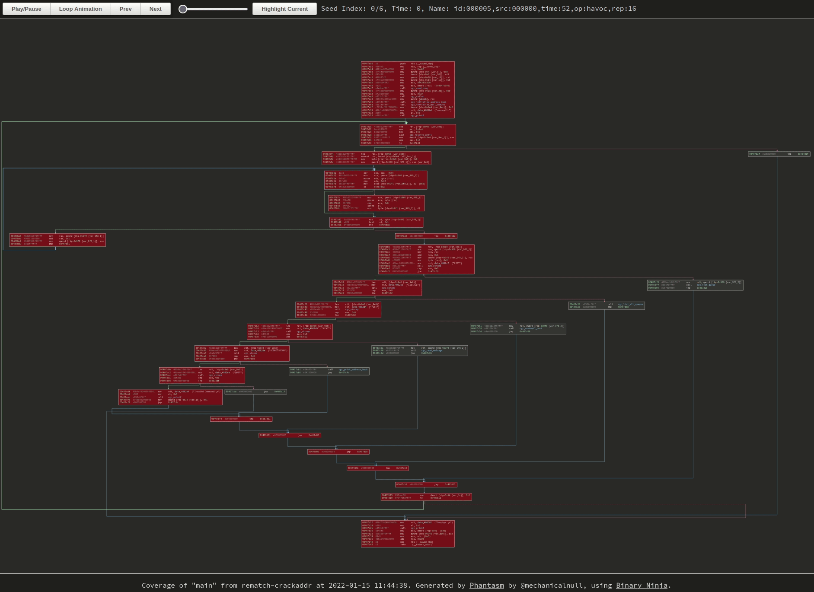

Software security is the esoteric art of staring at a wall of text and
extracting more information than the last person did.  Ok, that's (mostly) an
exaggeration, but sometimes it doesn't seem that far off the mark. I'm a
~~nerd for visualizations~~ advocate for expressing
data in visual format when it makes sense, so I wanted to play around with the
idea of trying to show how a fuzzer gradually discovers functionality in a 
target.

This idea of playing around and experimenting with visualizing something new
ended up being a new
[Binary Ninja plugin](https://github.com/mechanicalnull/phantasm) that is super
useful if you're curious about exactly this one thing (block coverage over
time), but otherwise might just serve best as a lava lamp for hackers?

|  |
| :-: |
| *Newly-discovered blocks start as red and fade to blue as frames progress. Click the image to go to the visualization, GIFs don't do it justice.* |

## Quick aside on connecting brains and eyeballs

My general goal when making visualizations is to make something that is pretty
to look at, intuitive, and useful. This turns out to be a high bar, as
"intuitive" and "useful" are both pretty subjective... but most of the time I am
trying to make a visualization that helps people understand something that might
otherwise be hidden or difficult to understand.

With a fuzzer, there's a few things that people are kind of curious about
seiing, and one of those is block coverage information. For people who
understand the structure of code, this intuitively makes sense because it shows
what functionality the fuzzer has discovered so far, and this is something I've
talked about [before]().

I like [bncov](https://github.com/ForAllSecure/bncov)'s default highlighting
scheme because the inverse heatmap allows me to understand at a glance how
commonly blocks are covered so far, kind of like showing the center of a tree vs
the smaller branches that split off from it. This is nice, but it doesn't show
anything about time, it only shows the result at the end. What I'd like to see
is how progress built over time, and that required a change of tactic.

BTW, If you're interested in visualizing input mutations instead, I covered that
in a [previous post]().

## Time to discover time

If you were trying to build a time-based visualization, your first question is
probably "where do we get the time data from?" and that's a good question. In
the case of most fuzzers, they save interesting testcases as files on disks and
you can use their creation times as a reference of roughly when they were
discovered by the fuzzer. Some fuzzers may even note the creation time in the
filename or in a database somewhere. Other very earnest and efficient fuzzers
may delete files when a better testcase is discovered that obsoletes the old
one, which is fine but it does kind of distort the true story of iterative
discovery.

But in AFL's case, you can just look in the `queue` directory and the files will
helpfully have good timestamps. From that point on you just have to be very
careful when copying those files around so you don't accidentally end up with
all of the files having a new (identical) timestamp. So then it's just a matter
of correlating the input testcase with it's block data, which is also easy if
you just use sane defaults like bncov does and name all your coverage files
after your input files, maybe using a `.cov` suffix or something. If you had
other way to get time information correlated with your coverage information
(like if it was stored in a database together), you could certainly use that
to. For most of us, we've just got our flat files.

So now that we've got time data and coverage data, we should be off to the
races, just have to display that data somehow! That's the... easy part... right?

## Let's make some pictures

As a starting point for visualization, I looked at the 
[export SVG](https://github.com/Vector35/binaryninja-api/blob/16019f2a175e3c459e4b99cd220ef86ee7853865/python/examples/export_svg.py)
example plugin to see how they were exporting basic blocks from Binary Ninja
and rendering them in an SVG. It's only one function at a time, but that's a
pretty good starting point to see if we can get that working.

Once I saw how they were setting colors it was pretty easy to use bncov
and apply color to covered blocks in the exported SVG. That's good progress! But
we want to show coverage getting added over time, which seems like it requires
animation of some sort...

I've not focused on web stuff as much in my work, so the SVG format was pretty
unfamiliar to me, but in addition to static images, SVG also looked like it was
capable of animation, which would be great for a visualization of coverage over
time. At this point I wasn't tied to one image format or way of doing things, I
was open to any idea as long as I could render it on a webpage.

Naturally I figured the fastest way was to use what was already in front of
me and started searching for ways to animate SVGs.  The Internet told me that I
was in luck and that there were multiple ways to animate SVGs, and some of these
ways seemed appropriate for what I was doing.

So I spent a bunch of time learning how to make CSS animation work on SVGs, only
to discover that on large graphs the pure CSS animation approach led to color
changes that aren't time-synced. So while I could put together a nice looped
animation that worked for small functions, it fell apart on medium-to-large
functions, which was a real bummer.

After recovering from that brief setback, I took the time to think about what I
really wanted from this visualization. Having a looped animation was pretty
flashy, but ultimately not as useful for really understanding details. Sometimes
it would take a couple of loops through the animation to see what blocks to
focus on, and that wasn't very helpful.

## The Second Shot at Animation

I had been trying to avoid Javascript because I wanted the visualization to be
as self-contained as possible (also, I'm pretty inexperienced with Javascript).
But it finally came to the point where I realized that Javascript was definitely
the way to go; I just had to bite the bullet and blunder my way through it.

Even though I was resistant to it at first, using Javascript allowed me to make
more of an interactive visualization instead of just a picture.  Certainly there
was a lot more I had to learn here and the resulting code is definitely not a
great way of doing things, but at the end of it I had something that I thought
was a more useful than just a looped animation.

Once I got the basic idea of how to move from one frame to the next, it wasn't
hard to add some buttons to allow single-stepping forward and back as well as
turning off looping. Adding a button to highlight all of the blocks of the most
recent seed was actually the trickiest bit, but even that wasn't too bad. Nope,
I take that back, trying to adding pan and zoom was strangely annoying and
horrible and never worked exactly the way I wanted it to... I must've blocked
that out.

|  |
| :-: |
| *Hard to tell without the cursor, but I'm clicking around on the buttons and zooming with the mousewheel. Click the image to browse to the original visualization and try it yourself.* |

However! In the end I was able to get something that at least meets the original
intent, a visualization that shows the coverage growth over time and allows the
user to peruse the graph at their leisure.

## Useful for the future?

So now that we can see the growth of coverage over time for a single function,
but is it pretty, intuitive, or useful?

It was useful in reinforcing exactly how coverage increased, though not in a
groundbreaking way, more of just a reminder of things that are apparent if you
stop and think about them. Even if a block is "new" or "rare", it doesn't come
in on its own; it's more likely to have shared predecessors/successors with
previous seeds than cut a new path through completely uncovered territory. When functions
have loops or get called multiple times, the "path" to a new block may not be
clear since block coverage doesn't show order or indicate multiple traversals.

In retrospect, I'm not sure that this in particular is something that fills a
need other than perhaps teaching, but it can at least be a starting point for
discussion of what else we might do like this.

We could visualize a comparison of multiple fuzzers or fuzz runs by using
different colors, which might be useful for understanding what parts of
the code are better solved by a particular technique.

We could look at displaying something larger than a single function. We could
stitch together blocks from multiple functions, like all of the covered blocks,
and just render it... but we'll quickly run into the problem of managing huge
graphs and how the unprepared mind seems to recoil from such monstrosities.
Might be interesting to tackle that another time.

If nothing else, it was useful to me because I learned some interesting things.
Maybe it'll even interest some more people in what fuzzers can do and what
cool visualizations we can make. I'll leave the decision of whether its pretty
or intuitive to the reader, you can view prebuilt examples either by clicking
the two GIFs in this blog or by pulling them out of
[the repo](https://github.com/mechanicalnull/phantasm)
and viewing them.
