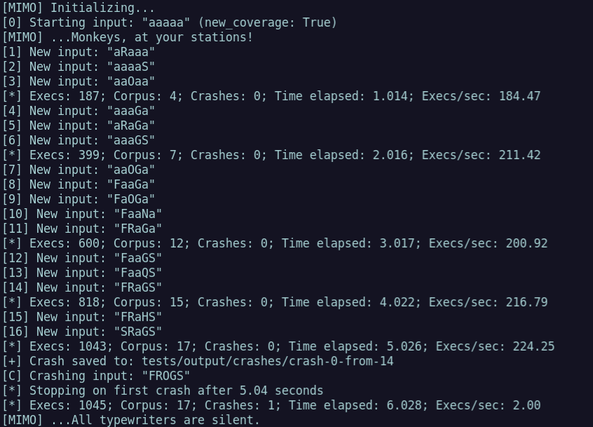
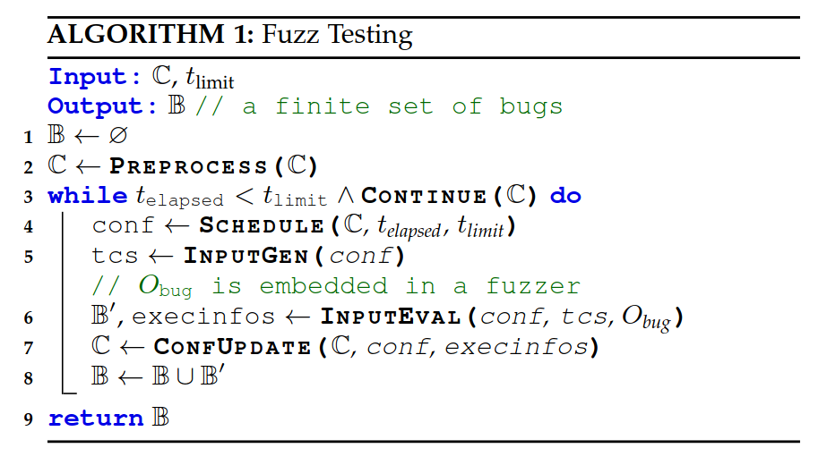

There's a lot of cool fuzzer research going on right now, both in extending
[AFL++](https://github.com/AFLplusplus/AFLplusplus)
and with interesting custom fuzzers being released. Using fuzzers has become
a fairly normal activity in the security community, but _writing_ fuzzers
still seems to be considered by some to be a minor form of sorcery.

Well I say today is the day we crack our knuckles and get down to some minor
sorcery as I share my experiment in writing a fuzzer I call MILLION MONKEYS (or
"MIMO" for short), which I hope will enable interesting future experiments... or
at least it'll be an exercise in learning more by coding things oneself.
I'll share my thought process below, maybe it'll be helpful for those who
haven't written a fuzzer before; everyone else can go
[check out the code](https://github.com/mechanicalnull/mimo).

## First, Invent the Universe

My goal wasn't to write the smallest fuzzer or the fastest fuzzer. My goal was
to write a fuzzer from scratch that would be small enough to be clear, but
flexible and modular enough to support arbitrary experimentation. Speed can come
later... "something something premature optimization" and all that.

This is trickier than it sounds, because loose coupling of modules can result in
verbose interface definitions, weird contortions in passing around 
information, or generally creating unnecessary overhead. And fuzzer authors
do everything they can to cut down overhead because speed directly
affects performance. 

For the most part, all fuzzers do the same basic things: they create new
inputs, they feed each new input to the target while observing execution, and
they take action based on the observations. So fuzzers do a lot the
same tasks, and there have even been some recent projects like
[Killerbeez](https://github.com/grimm-co/killerbeez) and
[Libafl](https://github.com/AFLplusplus/LibAFL)
that have been written to make a fuzzing framework with swappable components,
which is a pretty neat idea.

|  |
| :-: |
| *How [one paper](https://arxiv.org/pdf/1812.00140.pdf) describes the algorithm common among fuzzers* |

## How is Fuzzer Formed?

Let's dig into the basic components a fuzzer needs to implement the three
steps of input generation, executing input, and acting on execution feedback.

Input generation usually means either mutating existing inputs or
generating new ones via a model of some sort. Implementing mutations is easy,
but there's a bit of hidden complexity here: there are basically unlimited ways
to mutate or generate inputs, so there are important decisions to make regarding
the scheduling and prioritization of input generation.

Executing inputs (aka "run the target") sounds straightforward, but most fuzzers
only support targets that take input in a few ways, or they require users to
write "harness" code that takes care of getting the target code set up and
feeding the input to the target. Harnessing like this requires manual effort,
but it allows a user to perfectly wrap up the code and tuck in all the edges
like a delicious burrito.

Execution feedback is a fun one because it's fundamentally simple, but common
implementations are somewhat complex because they use code coverage as the
primary component of feedback, which is nontrivial to gather and analyze in a
fast, generic, and effective way. Also, since feedback has to be gathered for
every input, any overhead from instrumenting the target to gather information is
typically multiplicative in terms of cost.  As a result, many fuzzers just adopt
AFL's approach to execution feedback, which has upsides (speed, well-known) and
downsides (bitmap collisions unless specifically checked for, tunnel-vision on
feedback form/implementation).

## Let's Get It Started

So I coded up some basic setup code and code to mutate inputs, and something
that could run a target. How do I tell when it's enough to be considered a
fuzzer that can do something?

Typically authors prove that a fuzzer works by having the fuzzer synthesize an
input that crashes a toy target without _a priori_ knowledge of what the input
is.  The snippet below illustrates the idea in its standard form.

```c++
if (in_buf[0] == 'F')
    if (in_buf[1] == 'u')
        if (in_buf[2] == 'Z')
            if (in_buf[3] == 'z')
                abort();
```

To make things a little more interesting, I wrote a target with behavior that
mimics that of the popular game [Wordle](https://www.nytimes.com/games/wordle)
where the user guesses a 5-letter word and gets feedback based on how many
letters they guess correctly and whether or not the letter is in the right
position. It's not a perfect clone of wordle, but the paradigm of
guess-and-get-feedback works well to show fuzzing progress.

The simplest form of execution feedback is "did the target crash or not?" and
once upon a time that's all fuzzers looked for. So that's what I started with,
both for experimental purposes and also because it's the easiest thing to
implement.

When it comes to mutating inputs, the simplest thing to do is to try just
flipping a single bit at a time. Since this fuzzer is not fast, but it does make
customization easy, I also made a mutator that would pick a random byte and
change it to a (different) random letter.

This may seem like a random detail, but a fuzzer can waste a lot of time trying
inputs that the user might know to be useless, and in this case we know that the
inputs will contain only letters, so let's go ahead. Sometimes the approach of
more actively guiding the fuzzer can mean the difference between fuzzing forever
with no progress and finding a crash in a matter of minutes.

## Are We Fuzz Yet?

Testing my newly-minted fuzzer started with just seeing if it was generating the
kinds of inputs expected and how fast it was going. The discussion of speed is
mostly just so we can see what bottlenecks emerge as we start hooking things
together, because we want to see where the real bottlenecks are for
future optimizations.

So we start with just asking the mutator to generate inputs and not sending it
to the target, and then gradually hook things up to see how performance settles.
The simplest mutator is just flipping a single bit, and this should give us an
idea of the upper limit we could ever expect. Picking a random character is a
little more complex but not nearly as intensive as some of the things we'll
eventually get to (like splicing inputs together), but it'll give us an idea of
the difference between basic mutators.

After that, then we can hook up the target and see how adding running a new
target process and feeding an input into it might slow it down. Lastly, we add
checking the feedback for each iteration and use it to inform our mutation
scheduling.

Comparison of iteration speed on one core:
- Python bit flipper: 925,000 inputs/sec
- Python ascii letter chooser: 800,000 inputs/sec
- Ascii mutator, sending input to target: 1100 execs/sec
- Ascii mutator, sending input to target, and checking coverage: 210 execs/sec

These give us an idea of speed, and while it seems like we've tanked, the last
entry is the only one that finds the crashing input in any reasonable amount of
time (obviously the first two don't even run the target, so...). This is because
the feedback from coverage information is critical to generating new behaviors
and getting closer to the answer.

Since I didn't want to deal with compiler instrumentation and bitmap details
just yet, I wrote the target so that would be "cooperative" in that it would use
unique return codes to communicate when it performed different behaviors.  This
isn't something we can count on in the general case, but we can use it to prove
out the idea until we get proper coverage working.

This execution feedback means the fuzzer can add new inputs to our
corpus, but but we still have the problem of scheduling which input to mutate.
While we won't keep multiple inputs that produce the same result, right now the
execution feedback doesn't have a sense of which input is best, just that every
one we saved has different behavior.

|  |
| :-: |
| *The fuzzer finds "new" behavior without knowing what is "best"* |

Astute readers might notice that the change-one-random-letter mutator will only
get us one letter closer at a time, which means that if we go with the naive
approach of picking a random input and mutating it, we actually will worsen our
chances of getting closer to the right answer as we get closer to the answer.
This is because as the number of inputs goes up, the chances of picking the
input that is currently closest to the answer goes down.

Using round-robin as our scheduling algorithm is a great comparison because it
is still general a general (but more equitable) approach and it performs _much_
better.  Round robin scheduling of inputs for mutation pops out the answer in as
little as 5 seconds with a single core, as opposed to minutes if we use random
scheduling.  This is still a naive approach as it doesn't try to track
uniqueness, depth, or ancestry of inputs, but this kind of experimentation with
scheduling is exactly what MIMO is built for!

## Time to Start Monkeying Around

This gives us a decent stopping point for part 1. We have a fuzzer that is
generalized but still fairly straightforward, and it works against toy targets
using return codes as execution feedback. It's not fast, and we've got a long
way to go, but we can start building interesting things on top of it very
easily. In the future we'll talk about adding real coverage and making this a
more viable fuzzer for real use, as well as performance improvements and trying
out custom strategies.

As a closing note: if you think fuzzing is interesting, you should try to write
your own fuzzer. It's pretty fun, and I think there's a big chasm between "I
know how something works" and "I've written one". Good luck out there, fellow
fuzzers!
