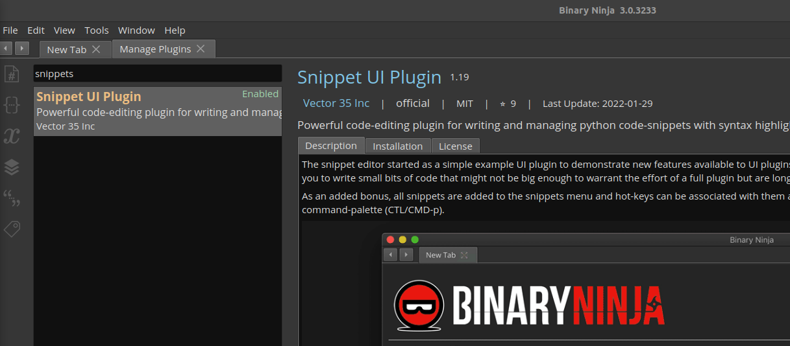
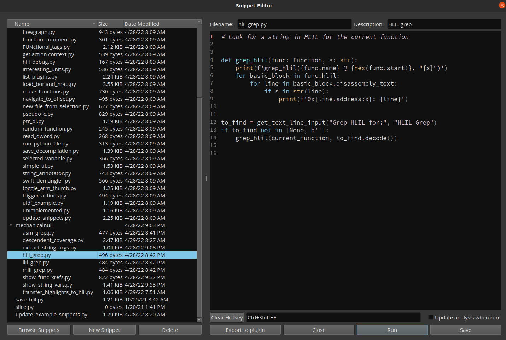
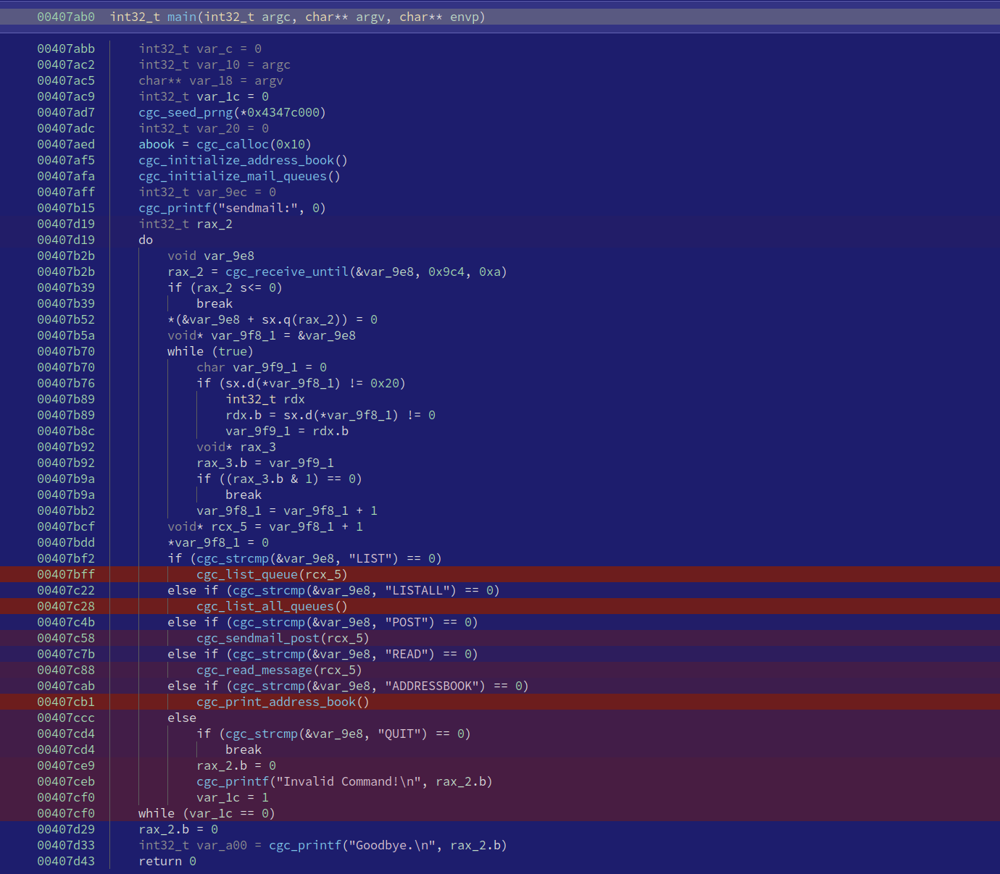

Let's talk about one of the reasons I like Binary Ninja's API-first approach and
how it makes it easy to manipulate, extend, and customize Binary Ninja as an
analysis platform.  In general, I think one of the best ways to increase
understanding is to try to implement things yourself or extend existing tools.
Binary Ninja makes this pretty straightforward, and I think writing and using
snippets is the easiest way to build your own ninja powers and borrow the powers
of other. I'm going to share the workflow for setting up your own snippet set as
well as some of my favorite snippets.

Links: Jump to 
[snippet explanations](#snipping-for-fun-and-profit)
, or
[here](https://gist.github.com/mechanicalnull/b19c29ce38152b7304c2fad66168badd)
if you just came for the snips.

## Making Your Own Snipset

All users of Binary Ninja should be aware of the built-in Python console and how
awesome it is to just be able to write a few lines and get the answer you want,
but sometimes you need just a little more logic than fits in a few lines (and 
these days the console even resizes a bit instead of the old days when the
console would only show one line at a time). Or maybe you want to
reuse or share the code you're writing. Snippets is the way to go for everything
short of writing a plugin.

The workflow that I'd suggest is making your own set of
snippets and syncing them to GitHub (or your own private git server if you
prefer). This is the workflow that [psifertex](https://github.com/psifertex)
from Binary Ninja has set up as the example, and that's what I'm doing here. It
makes it easy to get your code if you ever find yourself needing to demo
something to a friend or otherwise not on your machine.

I started by popping into the plugin manager (CTRL+SHIFT+M) and making sure I
have the _official_ Snippet UI Plugin with its *golden* name, and once it's
installed/enabled we should see `Snippets` menu under `Tools`. 
If you haven't updated it in a while, it now comes with
an `update_example_snippets.py` that is also registered under the menu. Just run
this script and it pulls down snippets from a gist and into a folder.

Convenient, eh? This is the workflow I'm going to mirror.

First, start by forking
[psifertex's Snippet Collection](https://gist.github.com//psifertex/6fbc7532f536775194edd26290892ef7)
to get your own URL to point to, and then customize the contents. I opened up
`update_example_snippets.py` locally and fixed the `path`, `folder`, and
`tab2space` values to match my own, as shown below. I also changed the warning
message so I know it's my snippets being updated and not the example ones.

```python
path = b'mechanicalnull/b19c29ce38152b7304c2fad66168badd'
subfolder = 'mechanicalnull'
tab2space = True  # It's not worth arguing with strangers on the Internet
```

I then do `Reload all snippets` and run the update script. I see my custom
warning and my content (saved to the user folder, `~/.binaryninja/snippets`),
and that means we're off to the races!



I like to code in a full IDE, so I don't always use the snippet editor, but it
does make the code/run/debug cycle very fast!


## Snipping for Fun and Profit

I'm going to over the idea and show the primary functionality for each snippet,
but if you want to grab them all, just check out
[the gist](https://gist.github.com/mechanicalnull/b19c29ce38152b7304c2fad66168badd).

### HLIL/MLIL/LLIL/assembly grep

This is as basic as it gets, but I find myself using this all the time. Handy
for simple stuff like quickly tracking down the different locations a child
function is called and with what args. I primarily use the HLIL grep, but the
code is almost identical for each. Implementing a regex instead of simple
string matching is an easy modification if you need that.

```python
def grep_hlil(func: Function, s: str):
    print(f'grep_hlil({func.name} @ {hex(func.start)}, "{s}")')
    for basic_block in func.hlil:
        for line in basic_block.disassembly_text:
            if s in str(line):
                print(f'0x{line.address:x}: {line}')

to_find = get_text_line_input("Grep HLIL for:", "HLIL Grep")
if to_find not in [None, b'']:
    grep_hlil(current_function, to_find.decode())
```

### Show Everywhere This Function is Called

This isn't that different than grepping, but it pivots off cross-references to
avoid looking at every function and every basic block. Useful for similar
reasons as grep, and sometimes this is what you want instead of the normal
xref window because this allows you to see the HLIL call or do any other
programmatic functionality you want on an xref...

```python
def find_func_xrefs(bv: BinaryView, func_name: str):
    try:
        func_to_find = next(f for f in bv.functions if func_name in f.name)
    except StopIteration:
        print(f'"{func_name}" not matched in function names')
        return

    xrefs = {
        xref.address: xref.function 
        for xref in bv.get_code_refs(func_to_find.start)
    }

    if len(xrefs) == 0:
        print('No xrefs to "{func_name}" found!')
        return
    else:
        for addr, func in sorted(xrefs.items()):
            hlil = func.get_llil_at(addr).hlil
            print(f'{hex(hlil.address)}: {hlil}')
```

### Extract String Arguments

This is a variation of one I shared in my
[crackaddr rematch post](),
and it can come in handy if you want to extract string arguments from particular
functions, either for forming a dictionary or for just for RE purposes. This
also allows you to specify or filter out functions if you are only interested in
certain functions.

```python
string_args = set()
filter_out = ['printf']  # Names of functions to skip
keep_only = []           # Match only these function names

for mf in bv.mlil_functions():
    for ml_inst in mf.instructions:
        if ml_inst.operation == MediumLevelILOperation.MLIL_CALL:
            # filter on function names
            called_function = bv.get_function_at(ml_inst.operands[1].value)
            if not called_function: 
                continue
            if filter_out and called_function.name in filter_out:
                continue
            if keep_only and called_function.name not in keep_only:
                continue
            # CALL args are third in "operands"
            for arg in ml_inst.operands[2]:
                if isinstance(arg, MediumLevelILConstPtr):
                    maybe_string = bv.get_string_at(arg.value)
                    if maybe_string:
                        string_args.add(maybe_string.value)

for s in sorted(string_args):
    print(repr(s))
```

### Show Me Current Function Strings!

Just another string helper, but this one uses LLIL to try to get strings and
is helpful when you're looking at understanding a function or pivoting on
string xrefs.

```python
def get_pointers(bv: BinaryView, llil_inst: LowLevelILInstruction):
    for i, operand in enumerate(llil_inst.operands):
        if not hasattr(operand, 'operation'):
            continue
        if operand.operation == LowLevelILOperation.LLIL_CONST_PTR:
            address = operand.value.value
            var = bv.get_data_var_at(address)
            if var:
                yield var
        else:
            get_pointers(bv, operand)

def show_string_vars(bv: BinaryView, func: Function):
    string_refs = {}
    for llil_inst in func.llil_instructions:
        for var in get_pointers(bv, llil_inst):
            var_sym =  bv.get_symbol_at(var.address)
            if var_sym:
                var_name = var_sym.name
            else:
                var_name = f'data_{var.address:x}'
            if re.search(r'char.*[\[0-9a-fx]\]', str(var.type)):
                str_pointed_at = bv.get_ascii_string_at(var.address, min_length=1)
                if str_pointed_at is not None:
                    real_str = f'"{str_pointed_at.value}"'
                else:
                    real_str = '<Failed to get string>'
                string_refs[var.address] = f'{var_name}: {real_str}'
```

### bncov Translate Block Highlight to Instructions (Enable HLIL Highlight)

This is probably the most slick snippet in terms of visual appeal, something
that I tried out on a whim and it worked. Having block highlighting not show up
on HLIL is one of those things most people (including myself) expected to come
for free, but no, not yet anyway. This translates block highlights to
instruction highlights, which looks a little off in graph view, but it makes
HLIL highlighting work.

I've considered upstreaming this into bncov, but I'm just conservative with things
like these where there's potential for confusion between assembly basic blocks
and HLIL instructions when it comes to coloring, because I like my tools to
always show ground truth and warn when they introduce uncertainty. If you try
this out on the example data provided with bncov
(`bncov/tutorial/example/fuzztest`) you'll see how a number of blocks with
different colors get collapsed into one long HLIL statement.

```python
def transfer_highlights_to_instructions(covdb: bncov.CoverageDB):
    bv = covdb.bv
    for block_address in covdb.total_coverage:
        for block in bv.get_basic_blocks_starting_at(block_address):
            cur_highlight = block.highlight
            block.set_user_highlight(HighlightStandardColor.NoHighlightColor)
            cur_function = block.function
            cur_addr = block.start
            for cur_token, cur_inst_size in block:
                cur_function.set_user_instr_highlight(cur_addr, cur_highlight)
                cur_addr += cur_inst_size
```



### Show Child Function Coverage

Another bncov helper, this one helps with the common pattern of quickly
determining how much coverage there is below the current function.

```python
def recursive_print_node(
    cur_func: Function,
    function_coverage: dict,
    level: int,
    seen: Set[Function]
) -> Set[Function]:

    indent = '    '
    coverage_string = get_coverage_string(cur_func, function_coverage)

    if cur_func in seen:
        return seen

    print(f'{indent * level}{coverage_string}')
    seen.add(cur_func)

    children = set(cur_func.callees)
    sorted_children = sorted(
        children,
        key=lambda f: function_coverage[f.start].coverage_percent,
        reverse=True
    )
    for next_func in sorted_children:
        child_saw = recursive_print_node(next_func, function_coverage, level + 1, seen)
        seen.update(child_saw)

    return seen


def print_child_coverage(covdb: bncov.CoverageDB, func: Function):
    if not covdb.function_stats:
        print('Collecting function coverage statistics (one-time)...')
        function_coverage = covdb.collect_function_coverage()
    else:
        function_coverage = covdb.function_stats

    recursive_print_node(func, function_coverage, 0, set())
```

### Show Functions With Most Unique Paths

This approximates "unique paths" with bncov since block coverage doesn't
actually have full path information. It does give an idea of how many different
ways through a function have been exercised.  Just an idea I've been
toying with regarding complexity and how much has been exercised.

```python
def count_block_sets(covdb: bncov.CoverageDB, blocks: List[int]) -> int:
    trace_coverage = {}
    for cur_block in blocks:
        for trace in covdb.block_dict[cur_block]:
            trace_coverage.setdefault(trace, []).append(cur_block)
    coverage_sets = set([str(sorted(v)) for v in trace_coverage.values()])
    return len(coverage_sets)


def count_function_paths(covdb):
    bv = covdb.bv
    function_dict = covdb.get_functions_from_blocks(covdb.total_coverage)
    function_counts = {}
    for function_start, block_starts in function_dict.items():
        func = bv.get_function_at(function_start)
        unique_block_sets = count_block_sets(covdb, block_starts)
        function_counts[func] = unique_block_sets

    for func, num_sets in sorted(
        function_counts.items(),
        key=lambda kv: kv[1],
        reverse=True
    ):
        print(f'{func.name} @ {hex(func.start)}: {num_sets}')
```

## EOS (End of Snips)

That wraps the snippets I wanted to share, give them a try and drop me a DM on
Twitter if you find anything wrong or know a better way of doing one of these.

Now it's time for you to take up the Snippet Challenge and write
an awesome snippet and share it, maybe on the
[Binary Ninja Slack](https://slack.binary.ninja/) or Twitter!
